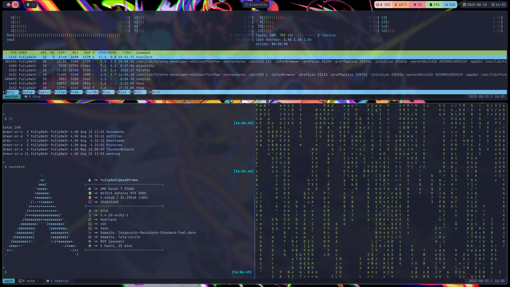
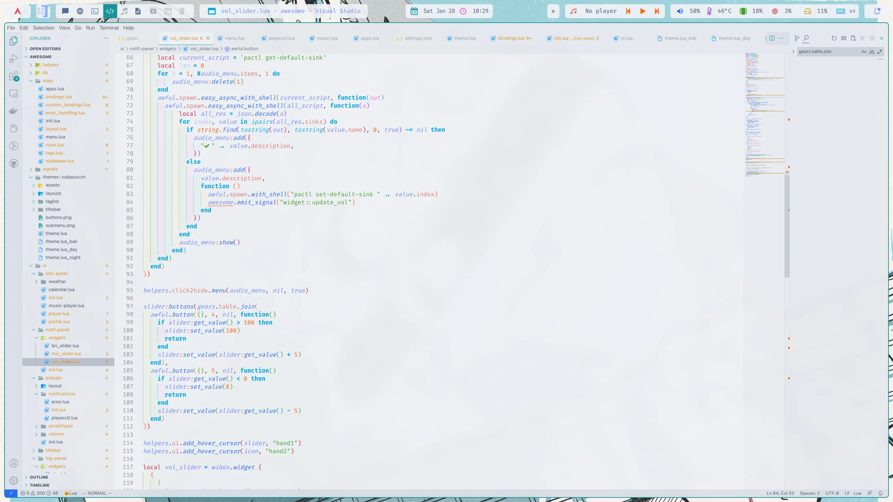
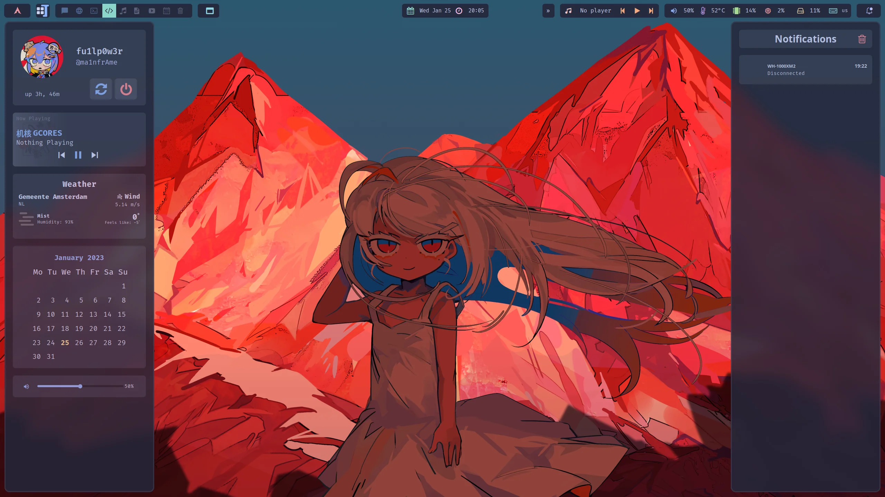
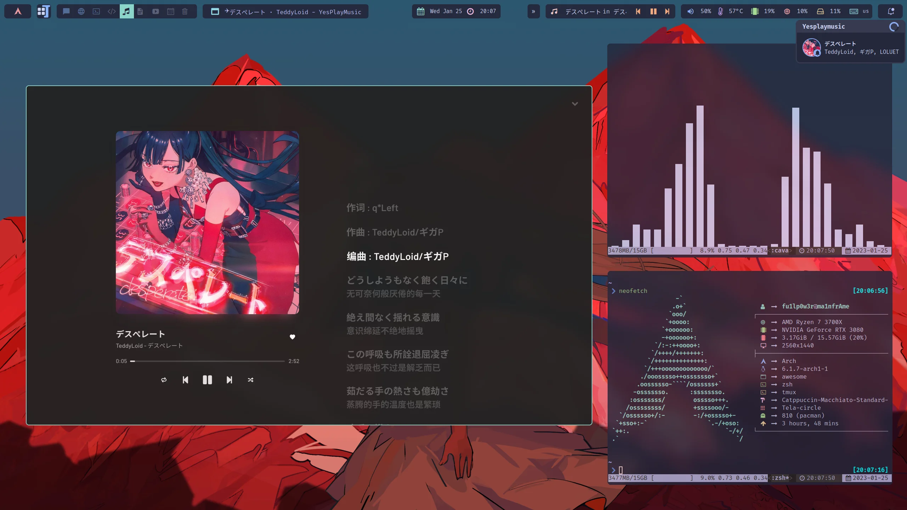
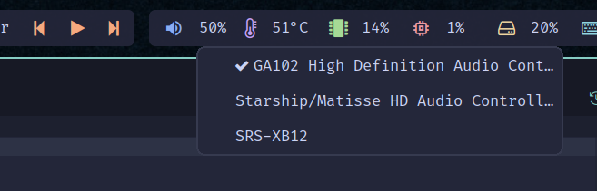
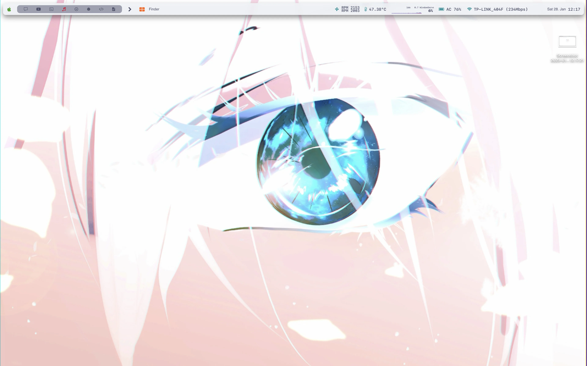
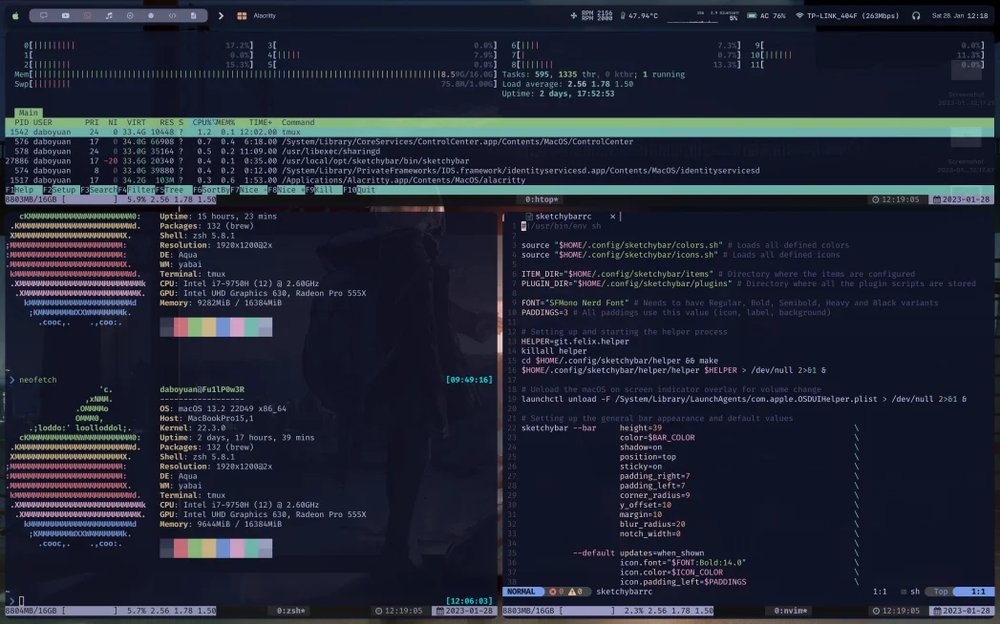

# Hail [Catppuccin](https://github.com/catppuccin/catppuccin)!!

## Arch Setup

### Info
+ WM: Awesome (Based on V2BlockBuster2K's amazing [work](https://github.com/V2BlockBuster2K/Awespuccin#readme))
+ Shell: Zsh
+ Terminal: alacritty
+ Compositor: picom
+ Editor: vscode / neovim

### Requirements
TODO...

## Arch Setup (Wayland)

### Info
+ WM: Hyprland
+ Bar: Waybar + eww
+ Shell: Zsh
+ Terminal: alacritty
+ Editor: neovim

### Requirements
TODO...

## MacOS Setup

### Info
+ WM: yabai
+ Shell: Zsh
+ Terminal alacritty
+ Bar: sketchybar
+ Editor: vscode / neovim

### Requirements
TODO...

## Screenshots

### Arch
#### Wayland

#### Light variant

#### Dark variant

#### Audio picker:

### MacOS

